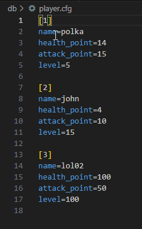

# virvadb

virvadb is a simple data base that save your data into INI file format 

# Purpose of virvadb

I build  virvadb  primarly for the data driven 2D game engine Im working on right now , as it is more easy to work with INI files. But you can use it for all sort of application. 

# Features
[x] Create a custom database with any extension e.g (db.mydb, map.data)

[x] CRUD operations

[x] all element are '&str' type

# Getting Started 

## Installation

```bash
cargo add virvadb
```

## Usage
```rust
//import virvadb
>>> use virvadb;

// create a new db
>>> let db_path="mydesktop/player.db";

>>> virvadb::new(db_path);

// create data
>>> let player_data=vec![("name","polka"), ("health_point", "14"), ("attack_point","15"), ("level","5")];

>>> virvadb::insert(db_path, &player_data);

// read data
>>> let db=virvadb::get_db(db_path);

>>> let data_position=1;

>>> let player_name=&db[Some(data_position.to_string())]["name"];

>>> println!("the player name is {}", player_name);

// update data
>>> virvadb::update(db_path, &vec![("name", "john")], data_position);

// delete single data 
>>> virvadb::delete(db_path, data_position);

// delete all data
>>> virvadb::delete_all(db_path);
```
# Basic database Preview


# TODO

[] Make it fast on data intensive task , like tileset editing (currently very slow)

[] Protect the database with password

and many more ...

# Contribution 

virvadb ❤️ contributor, wait for your pull request.
